# Bamazon

# Node.js & MySQL

## Overview

Create an Amazon-like storefront with a MySQL backend and an inquirer CLI frontend. The app takes in orders from customers and depletes stock from the store's inventory. The app also allows you to track product sales across the store's departments and then provides a summary of the highest-grossing departments in the store.

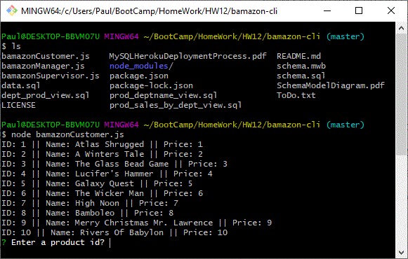

### GitHub Access

- [Source code repository](<https://github.com/pvraab/bamazon-cli>)

  This is a Node.js application so if you want to run it you must:

  - git clone it to your local machine
  - cd working directory - use git bash shell
  - npm install - to install all of the Node.js required packages as described in package.json
  - node bamazonCustomer.js - this will run the Customer app
  - node bamazonManager.js - this will run the Manger app
  - node bamazonSupervisor.js - this will run the Supervisor app

### Challenges

This was a pretty straightforward application to develop. The use of a view to deliver the product sales by department and total profit functionality was an interesting exercise.

### Detailed Functionality and Results

This application uses a MySQL database to structure and store information for this application (see the appendix for the relevant SQL scripts).

- Use a MySQL Database called bamazon.
- One table inside of that database is called products.
  - The products table has the following columns:
     - item_id (unique id for each product)
     - product_name (name of product)
     - department_id (foreign key to department table to get department name)
     - price (cost to customer)
     - stock_quantity (how much of the product is available in stores)
     - product_sales column (when a customer purchases anything from the store, the price of the product multiplied by the quantity purchased is added to the product's product_sales column)
  - This database table is initially populated with 10 different products.
- Another MySQL table is called departments. 
  - This table includes the following columns:
    - department_id (unique id for each department)
    - department_name (name of department)
    - overhead_costs (the overhead cost of each department)

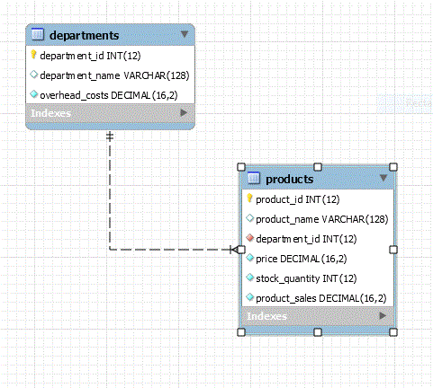

Three Node applications are used to view and manage the data in these tables.

### Customer View

- node bamazonCustomer.js  - Runs a Node application providing a customer view that will first display all of the items available for sale including the ids, names, and prices of products for sale.
- The app prompts users with two messages.
   - The first asks them the ID of the product they would like to buy.
   - The second message asks how many units of the product they would like to buy.
- Once the customer has placed the order, the application checks if the store has enough of the product to meet the customer's request.
   - If not, the app logs a phrase like `Insufficient quantity!`, and then prompts the useer to try again.

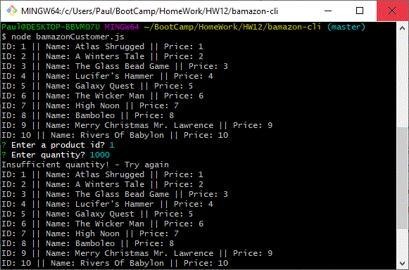

- However, if the store _does_ have enough of the product, the customer's order is fulfilled.
   - The MySQL database is updated to reflect the remaining quantity and the product sales is increased to reflect the order.
   - Once the update goes through, customer is shown the total cost of their purchase.

------

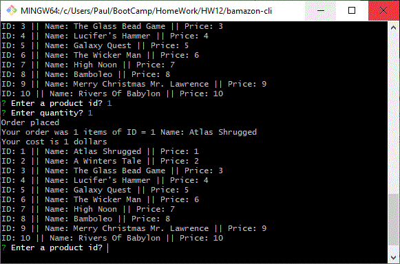

------

### Manager View

- node bamazonManager.js  - Runs a Node application providing managers view of the store. Running this application will:
  - List a set of menu options:
    - View Products for Sale
    - View Low Inventory
    - Add to Inventory
    - Add New Product
    - Exit
  
  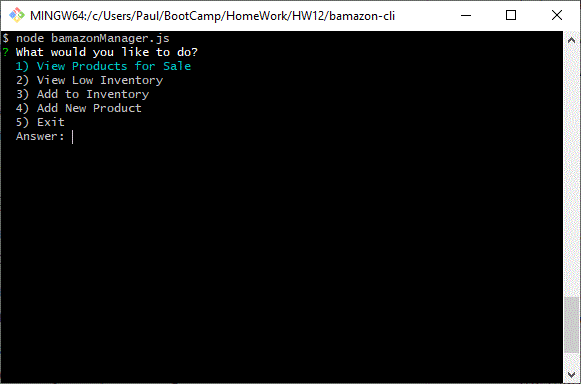
  
  - If a manager selects `View Products for Sale`, the app will list every available item: the item IDs, names, prices, and quantities.
  
  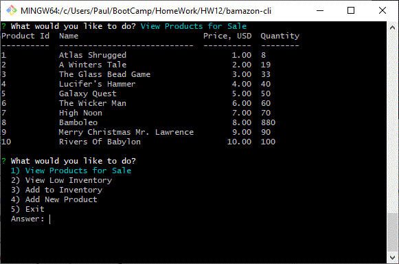
  
  - If a manager selects `View Low Inventory`, then it will list all items with an inventory count lower than five.
  
  
  
  - If a manager selects `Add to Inventory`, the app displays a prompt that will let the manager "add more" of any item currently in the store.
  
  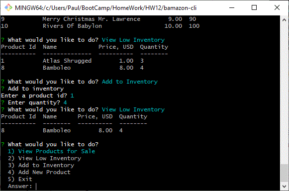
  
  - If a manager selects `Add New Product`, the app allows the manager to add a completely new product to the store.
  
  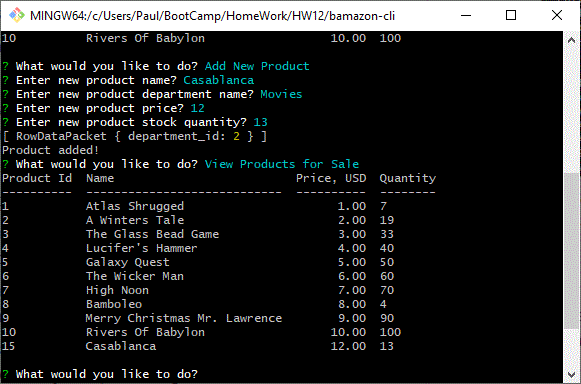

------

### Supervisor View

- node bamazonSupervisor.js  - Runs a Node application that will provide a supervisors view of the store. Running this application will:

  - list a set of menu options:

    - View Product Sales by Department
    - View Departments
    - Add New Department
    - Exit
  

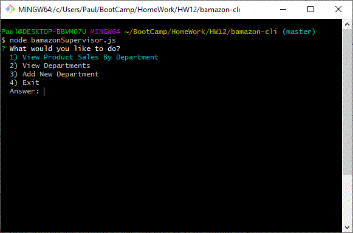

- When a supervisor selects `View Product Sales by Department`, the app displays a summarized table describing the summed product sales and the resulting total profit for each department. This functionality uses a SQL View prod_sales_by_dept described in the appendix of this document to dynamically calculate the total_profit value.

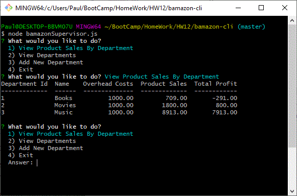

- - When a supervisor selects View Departments, the app displays a the current departments.

  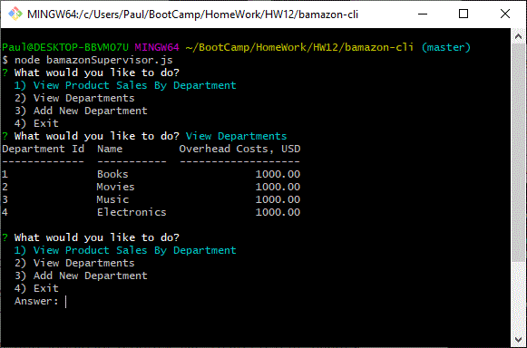

  - When a supervisor selects Add New Departments, the app allows the supervisor to add a new department.

  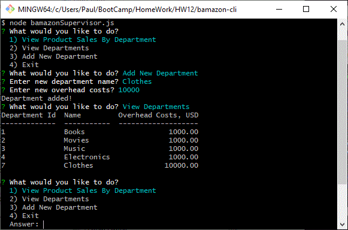

### Technologies Used

- MySQL
- SQL
- Entity-Relationship diagram (ERD)
- JavaScript
- Node.js
- npm package inquirer to ask questions
- npm package mysql to allow connections to the MySQL database
- npm package easy-table to present SQL result sets in table form
- Good Quality Coding Standards used
- Deployed on [GitHub](<https://github.com/pvraab/bamazon-cli>)

------

- Added To my portfolio at:

  [My Portfolio](<https://pvraab.github.io/RaabPortfolio/>) - navigate to the portfolio page.

### Appendix

ERD of bamazon schema


The following SQL scripts were used to create the bamazon schema objects:

#### Main bamazon schema to create the departments and products tables

```
-- Drop and create `bamazon` schema
DROP SCHEMA IF EXISTS `bamazon` ;
CREATE SCHEMA IF NOT EXISTS `bamazon` DEFAULT CHARACTER SET ascii;
USE `bamazon` ;

-- Table `bamazon`.`departments`
CREATE TABLE IF NOT EXISTS `bamazon`.`departments` (
    `department_id` INT(12) NOT NULL AUTO_INCREMENT,
    `department_name` VARCHAR(128) NULL DEFAULT NULL,
    `overhead_costs` DECIMAL(16,2) NOT NULL DEFAULT '0.0000',
    PRIMARY KEY (`department_id`),
    INDEX `department_id` (`department_id` ASC)
);

-- Table `bamazon`.`products`
CREATE TABLE IF NOT EXISTS `bamazon`.`products` (
    `product_id` INT(12) NOT NULL AUTO_INCREMENT,
    `product_name` VARCHAR(128) NULL DEFAULT NULL,
    `department_id` INT(12) NOT NULL,
    `price` DECIMAL(16,2) NOT NULL DEFAULT '0.00',
    `stock_quantity` INT(12) NOT NULL DEFAULT '0',
    `product_sales` DECIMAL(16,2) NOT NULL DEFAULT '0.00',
    PRIMARY KEY (`product_id`),
    INDEX `product_id` (`product_id` ASC),
    CONSTRAINT `fk_departments_department_id` FOREIGN KEY (`department_id`)
        REFERENCES `bamazon`.`departments` (`department_id`)
        ON DELETE NO ACTION ON UPDATE NO ACTION
);

```

#### Product Sales By Department View

```

-- Create Product Sales by Department view
USE bamazon;

CREATE OR REPLACE VIEW prod_sales_by_dept AS
SELECT 
    a.department_id,
    a.department_name,
    a.overhead_costs,
    SUM(b.product_sales) product_sales,
    SUM(b.product_sales) - a.overhead_costs total_profit
FROM
    departments a,
    products b
WHERE
    a.department_id = b.department_id
GROUP BY b.department_id;

```

